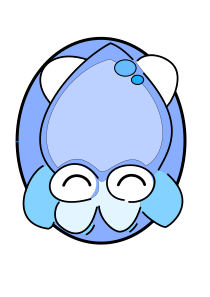

# Rubber-Squid

Simple [pelican](https://blog.getpelican.com/) theme customised to work with 
[my own personal website](https://beardedplatypus.github.io/). The theme is 
build with [Bulma.io](https://bulma.io/), and the design is heavily inspired 
by the [Tale theme](https://themes.gohugo.io/tale-hugo/) for Hugo.

The current implementation is still very rough, and missing a bunch of 
components. I will add those as I need them for my own website. 
